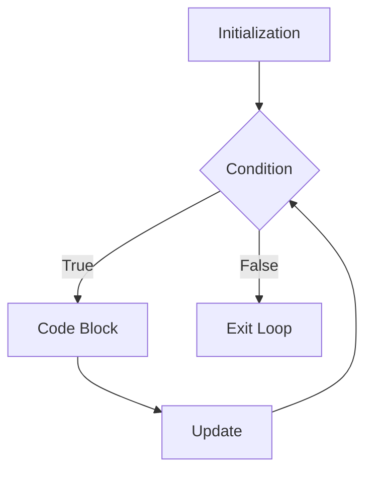

# Day 1 Notes — Introduction to C++


## C++
- IT is a compiled language, which means code is converted to machine language before execution.
- It is a general-purpose programming language used for system/software development, game development, and more.
- C++ supports both procedural and object-oriented programming paradigms.
**Procedural Programming** focuses on writing procedures or routines that operate on data, while **Object-Oriented Programming (OOP)** organizes code into objects that contain both data and functions.

## How program execution works in C++ in detail:
1. **Compilation**: The C++ code is compiled into machine code by a compiler. Here we we also check for syntax errors and convert the human-readable code into a format that the computer can understand. 
2. **Execution**: The compiled code is executed by the operating system.
3. **Output**: The output of the program is displayed on the screen or saved to a file.

---

## How to run a C++ program:
1. Write the C++ code in a text editor and save it with a `.cpp` extension.
2. Open a terminal and navigate to the directory where the file is saved.
3. Compile the code using a C++ compiler (e.g., `g++ filename.cpp -o output`).
4. Run the compiled program (e.g., `./output` on Unix/Linux or `output.exe` on Windows).


# 1. Structure of a C++ Program

Every C++ program follows a basic structure.

## Basic Syntax

```cpp
#include <iostream>
using namespace std;

int main() {
    cout << "Hello World";
    return 0;
}
```

---

## Explanation

### `#include <iostream>`

* `iostream` means **Input Output Stream**
* It allows us to use:

  * `cout` → output
  * `cin` → input

---

### `using namespace std;`

* `std` stands for **standard namespace**
* It helps us write:

```cpp
cout
```

instead of:

```cpp
std::cout
```

---

### `int main()`

* Execution of every C++ program starts from `main()`
* `int` means this function returns an integer value

---

### `return 0;`

* Indicates successful execution of the program

---

# Flow of a C++ Program

f(x) = Input → Processing → Output

This is the basic logic behind most programs.

---

# 2. Variables and Data Types

Variables are containers used to store data.

---

# Variable Declaration

## Syntax

```cpp
data_type variable_name;
```

Example:

```cpp
int age;
```

---

# Common Data Types

| Data Type | Meaning              | Example |
| --------- | -------------------- | ------- |
| `int`     | Integer values       | 10      |
| `float`   | Decimal numbers      | 3.14    |
| `double`  | Large decimal values | 99.9999 |
| `char`    | Single character     | 'A'     |
| `string`  | Text                 | "Mayur" |
| `bool`    | True/False           | true    |

---

# Example

```cpp
#include <iostream>
using namespace std;

int main() {

    int age = 21;
    float height = 5.9;
    char grade = 'A';
    string name = "Mayur";
    bool passed = true;

    cout << name;

    return 0;
}
```

---

# Variable Naming Rules

## Allowed

```cpp
studentName
_age
marks1
```

## Not Allowed

```cpp
1name
student-name
float
```

---

# 3. Input and Output (`cin`, `cout`)

---

# Output → `cout`

Used to print something on the screen.

## Example

```cpp
cout << "Hello";
```

---

# Input → `cin`

Used to take input from the user.

## Example

```cpp
int age;
cin >> age;
```

---

# Complete Example

```cpp
#include <iostream>
using namespace std;

int main() {

    string name;
    int age;

    cout << "Enter your name: ";
    cin >> name;

    cout << "Enter your age: ";
    cin >> age;

    cout << "Name: " << name << endl;
    cout << "Age: " << age;

    return 0;
}
```

---

# Important Symbols

| Symbol | Meaning     |
| ------ | ----------- |
| `<<`   | Send output |
| `>>`   | Take input  |

---

# `endl`

Moves cursor to next line.

```cpp
cout << "Hello" << endl;
cout << "World";
```

Output:

```cpp
Hello
World
```

---

# 4. Operators in C++

Operators are symbols used to perform operations.

---

# Arithmetic Operators

| Operator | Meaning        |
| -------- | -------------- |
| `+`      | Addition       |
| `-`      | Subtraction    |
| `*`      | Multiplication |
| `/`      | Division       |
| `%`      | Modulus        |

---

# Example

```cpp
int a = 10;
int b = 3;

cout << a + b; // 13
cout << a % b; // 1
```

---

# Relational Operators

Used for comparisons.

| Operator | Meaning            |
| -------- | ------------------ |
| `==`     | Equal to           |
| `!=`     | Not equal          |
| `>`      | Greater than       |
| `<`      | Less than          |
| `>=`     | Greater than equal |
| `<=`     | Less than equal    |

---

# Logical Operators

| Operator | Meaning |   |    |
| -------- | ------- | - | -- |
| `&&`     | AND     |   |    |
| `||`     | OR      |   |    |
| `!`      | NOT     |   |    |

---

# Example

```cpp
int age = 20;

if(age > 18 && age < 30) {
    cout << "Eligible";
}
```

---

# Assignment Operators

| Operator | Meaning             |
| -------- | ------------------- |
| `=`      | Assign              |
| `+=`     | Add and assign      |
| `-=`     | Subtract and assign |

---

# Increment/Decrement

```cpp
a++;
a--;
```

---

# 5. Conditional Statements

Used for decision making.

---

# `if` Statement

## Syntax

```cpp
if(condition) {
    // code
}
```

---

# Example

```cpp
int age = 20;

if(age >= 18) {
    cout << "Adult";
}
```

---

# `if-else`

```cpp
if(age >= 18) {
    cout << "Adult";
}
else {
    cout << "Minor";
}
```

---

# `else-if`

```cpp
int marks = 85;

if(marks >= 90) {
    cout << "A";
}
else if(marks >= 75) {
    cout << "B";
}
else {
    cout << "C";
}
```

---

# `switch` Statement

Used when there are multiple fixed choices.

---

# Syntax

```cpp
switch(variable) {

    case value:
        // code
        break;

    default:
        // code
}
```

---

# Example

```cpp
int day = 2;

switch(day) {

    case 1:
        cout << "Monday";
        break;

    case 2:
        cout << "Tuesday";
        break;

    default:
        cout << "Invalid";
}
```

---

# Why `break` is Important

Without `break`, execution continues into next cases.

---

# 6. Loops in C++

Loops repeat code multiple times.

---

# `for` Loop

Used when number of iterations is known.

---

# Syntax

```cpp
for(initialization; condition; update) {
    // code
}
```

---

# Example

```cpp
for(int i = 1; i <= 5; i++) {
    cout << i << endl;
}
```

Output:

```cpp
1
2
3
4
5
```

---

# Loop Flow


---

# `while` Loop

Used when iterations are unknown.

---

# Syntax

```cpp
while(condition) {
    // code
}
```

---

# Example

```cpp
int i = 1;

while(i <= 5) {
    cout << i << endl;
    i++;
}
```

---

# `do-while` Loop

Runs at least once.

---

# Syntax

```cpp
do {
    // code
}
while(condition);
```

---

# Example

```cpp
int i = 1;

do {
    cout << i << endl;
    i++;
}
while(i <= 5);
```

---

# Difference Between While and Do-While

| While                  | Do-While           |
| ---------------------- | ------------------ |
| Checks condition first | Executes first     |
| May run 0 times        | Runs at least once |

---

# 7. Basic Debugging

Debugging means finding and fixing errors.

---

# Types of Errors

---

# 1. Syntax Errors

Wrong grammar of code.

Example:

```cpp
cout << "Hello"
```

Missing semicolon.

---

# 2. Runtime Errors

Occurs while program runs.

Example:

```cpp
int a = 5/0;
```

---

# 3. Logical Errors

Program runs but gives wrong output.

Example:

```cpp
cout << 2 * 2 + 5;
```

If you expected 20, logic is wrong.

---

# Debugging Tips

## 1. Use `cout`

```cpp
cout << variable;
```

Print variables to check values.

---

## 2. Read Error Messages Carefully

Compiler often tells:

* line number
* type of error

---

## 3. Check Brackets and Semicolons

Most beginner mistakes happen here.

---

# Day 1 Practice Questions

## Beginner

1. Print your name
2. Add two numbers
3. Find area of rectangle
4. Check even or odd
5. Largest of two numbers

---

## Intermediate

6. Grade calculator
7. Calculator using switch
8. Print numbers 1 to 100
9. Sum of first N numbers
10. Multiplication table

---

# Homework Challenge

## Problem:

Take a number from the user and:

* check if it is even/odd
* positive/negative
* print table of that number

---

# Important Beginner Advice

## Do NOT memorize syntax blindly.

Instead:

* understand flow
* write code daily
* make mistakes
* debug yourself

That is how programming skill actually develops.
